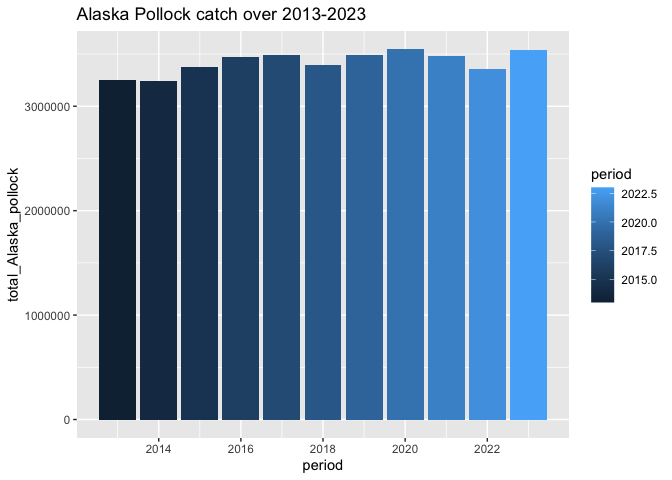

## Instructions
Answer the following questions and/or complete the exercises in RMarkdown. Please embed all of your code and push the final work to your repository. Your report should be organized, clean, and run free from errors. Remember, you must remove the `#` for any included code chunks to run.  

## Load the libraries

``` r
library("tidyverse")
library("janitor")
#library("naniar")
options(scipen = 999)
```

## About the Data
For this assignment we are going to work with a data set from the [United Nations Food and Agriculture Organization](https://www.fao.org/fishery/en/collection/capture) on world fisheries. These data were downloaded and cleaned using the `fisheries_clean.Rmd` script.  

Load the data `fisheries_clean.csv` as a new object titled `fisheries_clean`.

``` r
fisheries_clean <- read_csv("data/fisheries_clean.csv")
```

1. Explore the data. What are the names of the variables, what are the dimensions, are there any NA's, what are the classes of the variables, etc.? You may use the functions that you prefer.

``` r
glimpse(fisheries_clean)
```

```
## Rows: 1,055,015
## Columns: 9
## $ period          <dbl> 1950, 1951, 1952, 1953, 1954, 1955, 1956, 1957, 1958, …
## $ continent       <chr> "Asia", "Asia", "Asia", "Asia", "Asia", "Asia", "Asia"…
## $ geo_region      <chr> "Southern Asia", "Southern Asia", "Southern Asia", "So…
## $ country         <chr> "Afghanistan", "Afghanistan", "Afghanistan", "Afghanis…
## $ scientific_name <chr> "Osteichthyes", "Osteichthyes", "Osteichthyes", "Ostei…
## $ common_name     <chr> "Freshwater fishes NEI", "Freshwater fishes NEI", "Fre…
## $ taxonomic_code  <chr> "1990XXXXXXXX106", "1990XXXXXXXX106", "1990XXXXXXXX106…
## $ catch           <dbl> 100, 100, 100, 100, 100, 200, 200, 200, 200, 200, 200,…
## $ status          <chr> "A", "A", "A", "A", "A", "A", "A", "A", "A", "A", "A",…
```

``` r
summary(fisheries_clean)
```

```
##      period      continent          geo_region          country         
##  Min.   :1950   Length:1055015     Length:1055015     Length:1055015    
##  1st Qu.:1980   Class :character   Class :character   Class :character  
##  Median :1996   Mode  :character   Mode  :character   Mode  :character  
##  Mean   :1994                                                           
##  3rd Qu.:2010                                                           
##  Max.   :2023                                                           
##  scientific_name    common_name        taxonomic_code         catch           
##  Length:1055015     Length:1055015     Length:1055015     Min.   :       0.0  
##  Class :character   Class :character   Class :character   1st Qu.:       0.0  
##  Mode  :character   Mode  :character   Mode  :character   Median :       2.9  
##                                                           Mean   :    5089.9  
##                                                           3rd Qu.:     400.0  
##                                                           Max.   :12277000.0  
##     status         
##  Length:1055015    
##  Class :character  
##  Mode  :character  
##                    
##                    
## 
```


``` r
names(fisheries_clean)
```

```
## [1] "period"          "continent"       "geo_region"      "country"        
## [5] "scientific_name" "common_name"     "taxonomic_code"  "catch"          
## [9] "status"
```


2. Convert the following variables to factors: `period`, `continent`, `geo_region`, `country`, `scientific_name`, `common_name`, `taxonomic_code`, and `status`.

``` r
fisheries_clean %>% 
  mutate(across(c("period", "continent", "geo_region", "country", "scientific_name", "common_name", "taxonomic_code", "status"), as.factor))
```

```
## # A tibble: 1,055,015 × 9
##    period continent geo_region    country     scientific_name common_name       
##    <fct>  <fct>     <fct>         <fct>       <fct>           <fct>             
##  1 1950   Asia      Southern Asia Afghanistan Osteichthyes    Freshwater fishes…
##  2 1951   Asia      Southern Asia Afghanistan Osteichthyes    Freshwater fishes…
##  3 1952   Asia      Southern Asia Afghanistan Osteichthyes    Freshwater fishes…
##  4 1953   Asia      Southern Asia Afghanistan Osteichthyes    Freshwater fishes…
##  5 1954   Asia      Southern Asia Afghanistan Osteichthyes    Freshwater fishes…
##  6 1955   Asia      Southern Asia Afghanistan Osteichthyes    Freshwater fishes…
##  7 1956   Asia      Southern Asia Afghanistan Osteichthyes    Freshwater fishes…
##  8 1957   Asia      Southern Asia Afghanistan Osteichthyes    Freshwater fishes…
##  9 1958   Asia      Southern Asia Afghanistan Osteichthyes    Freshwater fishes…
## 10 1959   Asia      Southern Asia Afghanistan Osteichthyes    Freshwater fishes…
## # ℹ 1,055,005 more rows
## # ℹ 3 more variables: taxonomic_code <fct>, catch <dbl>, status <fct>
```

3. Are there any missing values in the data? If so, which variables contain missing values and how many are missing for each variable?

``` r
#NA
```

4. How many countries are represented in the data?

``` r
fisheries_clean %>% 
  distinct(country) %>% 
  summarize(countries_number=n_distinct
            (country))
```

```
## # A tibble: 1 × 1
##   countries_number
##              <int>
## 1              249
```

5. The variables `common_name` and `taxonomic_code` both refer to species. How many unique species are represented in the data based on each of these variables? Are the numbers the same or different?

``` r
fisheries_clean %>% 
  distinct(common_name, taxonomic_code) %>% 
  summarize(common_name_species_number=n_distinct(common_name),
            taxonomic_code_species_number=n_distinct(taxonomic_code))
```

```
## # A tibble: 1 × 2
##   common_name_species_number taxonomic_code_species_number
##                        <int>                         <int>
## 1                       3390                          3722
```

No, they are not the same. There are 3390 unique common name species and 3722 unique taxonomic code species.

6. In 2023, what were the top five countries that had the highest overall catch?

``` r
fisheries_clean %>% 
  filter(period=="2023") %>% 
  group_by(country) %>% 
  summarize(total_sum_catch=sum(catch, na.rm=T)) %>% 
  arrange(desc(total_sum_catch)) %>% 
  slice_head(n=5)
```

```
## # A tibble: 5 × 2
##   country                  total_sum_catch
##   <chr>                              <dbl>
## 1 China                          13424705.
## 2 Indonesia                       7820833.
## 3 India                           6177985.
## 4 Russian Federation              5398032 
## 5 United States of America        4623694
```

7. In 2023, what were the top 10 most caught species? To keep things simple, assume `common_name` is sufficient to identify species. What does `NEI` stand for in some of the common names? How might this be concerning from a fisheries management perspective?

``` r
fisheries_clean %>% 
  filter(period=="2023") %>% 
  group_by(common_name) %>% 
  summarize(total_species=sum(catch, na.rm=T)) %>% 
  arrange(desc(total_species)) %>% 
  slice_head(n=10)
```

```
## # A tibble: 10 × 2
##    common_name                    total_species
##    <chr>                                  <dbl>
##  1 Marine fishes NEI                   8553907.
##  2 Freshwater fishes NEI               5880104.
##  3 Alaska pollock(=Walleye poll.)      3543411.
##  4 Skipjack tuna                       2954736.
##  5 Anchoveta(=Peruvian anchovy)        2415709.
##  6 Blue whiting(=Poutassou)            1739484.
##  7 Pacific sardine                     1678237.
##  8 Yellowfin tuna                      1601369.
##  9 Atlantic herring                    1432807.
## 10 Scads NEI                           1344190.
```

NEI stands for "Not Elsewhere Included," meaning that they have not been identified. This could be problematic for fishery management companies because this throws their data off, making it unclear.


8. For the species that was caught the most above (not NEI), which country had the highest catch in 2023?

``` r
fisheries_clean %>% 
  filter(period=="2023", common_name=="Alaska pollock(=Walleye poll.)") %>% 
  group_by(country) %>% 
  summarize(total_Alaska_pollock=sum(catch, na.rm=T)) %>% 
  arrange(desc(total_Alaska_pollock)) %>% 
  slice_head(n=5)
```

```
## # A tibble: 5 × 2
##   country                               total_Alaska_pollock
##   <chr>                                                <dbl>
## 1 Russian Federation                                1893924 
## 2 United States of America                          1433538 
## 3 Japan                                              122900 
## 4 Democratic People's Republic of Korea               58730 
## 5 Republic of Korea                                   28432.
```

The "Russian Federation" had the highest catch of Alaskan Pollock (or Walleye Pollock) in 2023.

9. How has fishing of this species changed over the last decade (2013-2023)? Create a  plot showing total catch by year for this species.

``` r
fisheries_clean %>% 
  filter(period>="2013", common_name=="Alaska pollock(=Walleye poll.)") %>% 
  group_by(period) %>% 
  summarize(total_Alaska_pollock=sum(catch, na.rm=T)) %>% 
  ggplot(mapping=aes(x=period, y=total_Alaska_pollock))+
  geom_col(mapping=aes(fill=period))+
  labs(title="Alaska Pollock catch over 2013-2023")
```

<!-- -->

It hasn't changed by much, increasing slightly over the years.

10. Perform one exploratory analysis of your choice. Make sure to clearly state the question you are asking before writing any code.

Which year had the highest catch of Silver scabbardfish?


``` r
fisheries_clean %>% 
  group_by(period) %>% 
  summarize(total_silver_scabbardfish=sum(catch, na.rm=T)) %>% 
  arrange(desc(total_silver_scabbardfish)) %>% 
  slice_head(n=10)
```

```
## # A tibble: 10 × 2
##    period total_silver_scabbardfish
##     <dbl>                     <dbl>
##  1   2018                 99039627.
##  2   1996                 96722828.
##  3   2000                 96581944.
##  4   2004                 96222870.
##  5   1997                 96003718.
##  6   2017                 95975677.
##  7   2005                 95844883.
##  8   1995                 95185361.
##  9   2019                 95147897.
## 10   1999                 94722921.
```

The year with the highest catch of Silver scabbardfish was 2018.

## Knit and Upload
Please knit your work as an .html file and upload to Canvas. Homework is due before the start of the next lab. No late work is accepted. Make sure to use the formatting conventions of RMarkdown to make your report neat and clean!  
